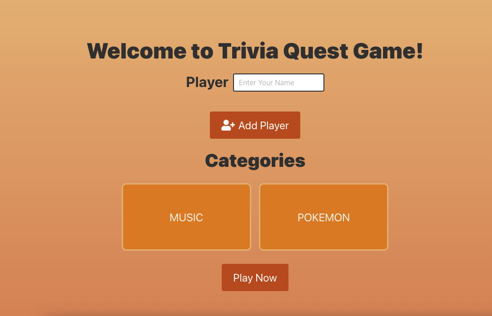
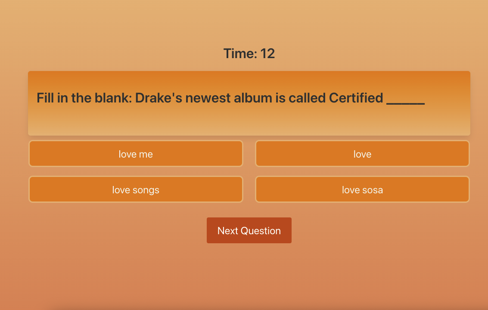
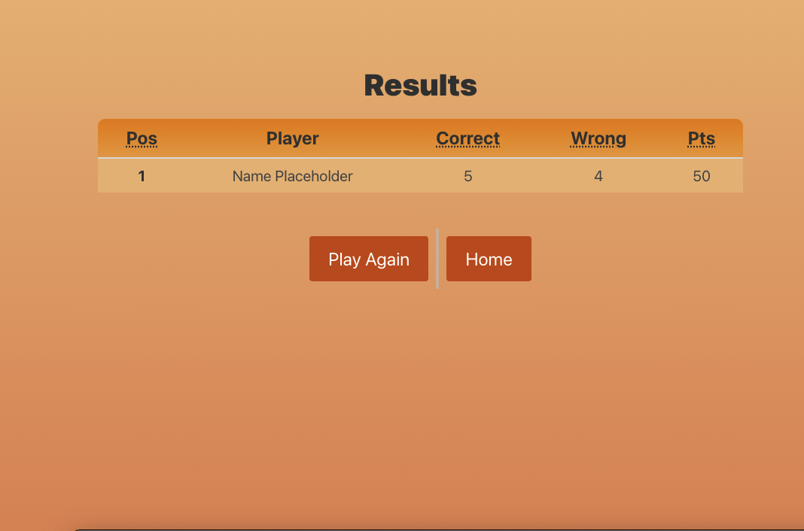

# trivia

# About
This is a trivia questions game application. It allows upto two players to contest with each others and further their general knowledge. The application intracts with wikipedia, pokemon and shazam APIs to get the required data. Players can add their name and select their preferred category to play the game. There are ten questions. The player who answered most of the questions will be the winner.

# Technologies Used

* HTML
* CSS
* BULMA CSS Framework
* Javascript
* Server Side APIs

# Contributer

* Juwon Oh
* Varoun Misra
* Daniel Fernandez
* Hekmatullah Salehi

# Screenshots of the Deployed Application

# Link

[Link to the Deployed Application](https://vbmisra.github.io/trivia/)

